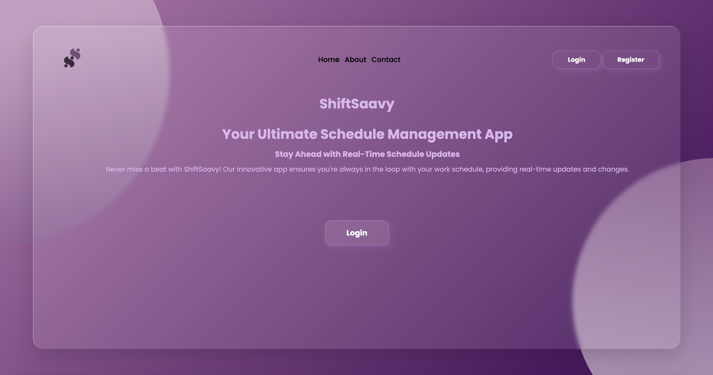
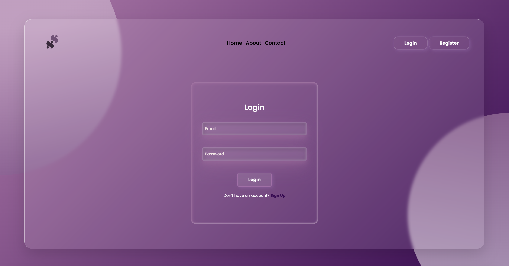
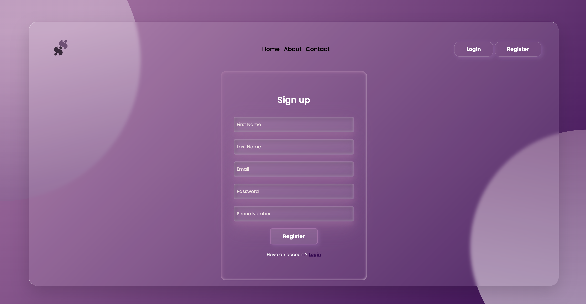
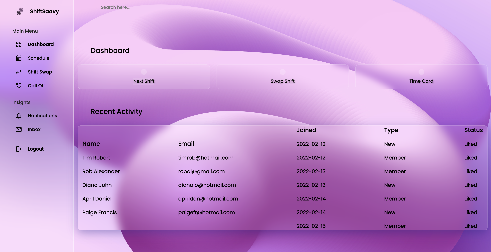

# ShiftSaavy

## Description

ShiftSaavy is a secured scheduling server created to reinvigorate the current state of what employee scheduling is, by reinventing the flexibility of schedule changes to be more dynamic it allows for a more precise and real time view of an employee's worklife. Through allowing employees to view in real time the entirety of the company's schedule no matter the time or place, then using this same information to personally make changes to an individual schedule is Shift Savy's bread and butter. When asked about the current state of employee issues with current scheduling process the complaints were across the board, Shift Savy is here to change that. Through the completion of this server a deeper understanding was found with structuring, naming conventions, and overall practicality of coding.

## Installation

To install this server one would need to download the repository from github 
node.js,
mySQL 
 insomnia 
 in order to fact check api routes, store data tables, and run the server. 

## Usage

When prompted to the server the employee registers for an account and upon this their information is saved in the server.

After signing in with their credentials the employee will be prompted to enter their authentication ID in order to satisfy the two factor authentication.

Upon passing the verification the user will move on to the landing page which will have their schedule displayed to them, there will be a nav bar present with "call off", "shift swap", and "schedule".

Call off will allow the user to view their schedule and select a specific day to call off of work for.

Shift swap would display the employee's schedule and when the user clicks on a specific day the schedules of employees working that same day will be displayed.

Schedule displays the employee's schedule on a monthly timetable.

## Credits

() - 
<ul>
    <li>Rasmi Roy</li>
    <li>Alexandrinov Silien</li>
    <li>Jael Dary (TCB)</li>

## License

MIT License

Copyright (c) [2024] [Jael Dary, Rasmi Roy, Alexandrinov Silien]

Permission is hereby granted, free of charge, to any person obtaining a copy
of this software and associated documentation files (the "Software"), to deal
in the Software without restriction, including without limitation the rights
to use, copy, modify, merge, publish, distribute, sublicense, and/or sell
copies of the Software, and to permit persons to whom the Software is
furnished to do so, subject to the following conditions:

The above copyright notice and this permission notice shall be included in all
copies or substantial portions of the Software.

THE SOFTWARE IS PROVIDED "AS IS", WITHOUT WARRANTY OF ANY KIND, EXPRESS OR
IMPLIED, INCLUDING BUT NOT LIMITED TO THE WARRANTIES OF MERCHANTABILITY,
FITNESS FOR A PARTICULAR PURPOSE AND NONINFRINGEMENT. IN NO EVENT SHALL THE
AUTHORS OR COPYRIGHT HOLDERS BE LIABLE FOR ANY CLAIM, DAMAGES OR OTHER
LIABILITY, WHETHER IN AN ACTION OF CONTRACT, TORT OR OTHERWISE, ARISING FROM,
OUT OF OR IN CONNECTION WITH THE SOFTWARE OR THE USE OR OTHER DEALINGS IN THE
SOFTWARE.

---

